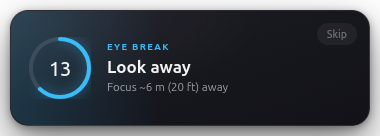
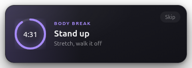
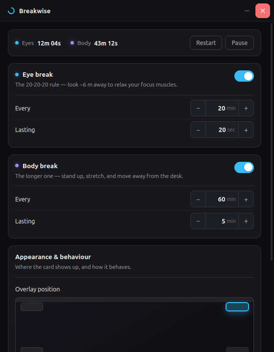

# Breakwise

A break reminder for Ubuntu that stays out of your way. A small card slides into
a corner of the screen, counts down, and closes itself. No fullscreen takeover,
no nagging.

Two independent timers:

- **Eye break** — the 20-20-20 rule. Every 20 minutes, look at something about
  6 m (20 ft) away for 20 seconds.
- **Body break** — the longer one. Every 60 minutes, stand up for 5 minutes.

Both are fully configurable, and a body break restarts the eye timer too (the
long break already rests your eyes).





## Install

There are no prebuilt downloads — you build it yourself. It is four commands
and takes a couple of minutes.

### What you need

- A Debian-based distro (Ubuntu, Mint, Pop!_OS, Zorin). Built and verified on
  Ubuntu 24.04 with GNOME on Wayland.
- **Node.js 20 or newer**, and npm.
- `git`.
- An internet connection for the first build — it downloads Electron, which is
  around 100 MB.

Check what you have:

```bash
node --version && npm --version && git --version
```

If Node is missing or older than 20, the [NodeSource packages](https://github.com/nodesource/distributions)
or [nvm](https://github.com/nvm-sh/nvm) are the usual ways to get a current one.
Ubuntu's own `nodejs` package is often too old.

### Build and install

```bash
git clone https://github.com/hasibul-hossain1/Breakwise.git
```

```bash
cd Breakwise && npm install
```

```bash
npm run dist:deb
```

```bash
sudo apt install ./dist/breakwise_1.0.0_amd64.deb
```

Now open **Breakwise** from your app menu. The settings window appears, and the
countdown starts. Turn on **Start with my session** if you want it running
after every login.

The `./` in that last command matters — without it apt looks for a package by
that name in its repositories and tells you it does not exist.

### Not on a Debian-based distro?

Build an AppImage instead:

```bash
npm run dist:appimage
```

```bash
chmod +x dist/Breakwise-1.0.0.AppImage && ./dist/Breakwise-1.0.0.AppImage
```

No install step — the file *is* the app. It does need `libfuse2`, which Ubuntu
22.04 and newer do not ship by default; if you see an error mentioning
`libfuse.so.2`, run `sudo apt install libfuse2t64`.

### Uninstalling

```bash
sudo apt remove breakwise
```

Your settings live in `~/.config/breakwise/` and are left behind; delete that
directory too if you want a clean slate.

## Development

```bash
npm install && npm run dev
```

`npm run dev` starts Vite with hot reload for the React UI — edit anything in
`src/renderer` and the window updates without restarting Electron.

Before opening a PR:

```bash
npm run typecheck
```

```bash
npm run build
```

The build ends with a verification step that fails if any output file is empty.
See the note at the bottom of this file for why that exists.

The tray icon needs the **Ubuntu AppIndicators** GNOME extension, which ships
enabled on Ubuntu by default. Without it the app still runs, you just get no
icon in the top bar.

## Using it

Launching the app opens the settings window. If it is already running, that
raises the existing window instead of starting a second copy — and it
**never resets a running countdown**. Use **Restart countdown**, in the tray
menu or next to the timers in settings, when you actually want to reset it.

The app lives in the system tray. From the tray menu you can see the countdown
to each break, take a break immediately, restart the countdown, pause
reminders, reopen settings, or quit.

There are deliberately **no desktop notifications**. The only things this app
puts on screen are the settings window and the break card.

Closing the settings window does **not** quit the app — the countdown keeps
running, which is the point. Quit from the tray menu, or:

```bash
pkill breakwise
```

Turn on **Start with my session** in settings to launch it at login. That writes
`~/.config/autostart/breakwise.desktop` with an `--autostart` flag, which starts
the app silently — countdowns running, no settings window in your face every
time you log in. It only does something useful for a packaged build; in dev it
would relaunch the bare Electron binary.

If you add it to startup applications by hand instead, append the flag —
`/opt/Breakwise/breakwise --autostart` — or you will get the settings window at
every login.

Settings are stored at `~/.config/breakwise/config.json`. Editing that file by
hand is safe: anything invalid falls back to the default.

## Contributing

Contributions are welcome. This started as a personal itch, so plenty of it is
rough and there is no shortage of things worth improving — the artwork on the
break cards, the settings layout, more break types, translations, packaging for
other distros.

The codebase is small: roughly a thousand lines across the main process and the
React UI, no state management library, no test framework to learn. `npm run dev`
gives you hot reload, so the loop is fast.

Two things to do before opening a PR:

```bash
npm run typecheck && npm run build
```

If you change anything visual, this renders both windows to `shots/` so you can
check the result without waiting for a real break:

```bash
npx electron scripts/capture.cjs
```

Bug reports are just as useful as code. If something misbehaves, the most
helpful thing you can include is:

```bash
journalctl --user --since "10 min ago" | grep -i breakwise
```

## Project layout

```
src/
  main/        Electron main process — no UI code
    index.ts       app lifecycle, IPC handlers, wiring
    scheduler.ts   the dual-timer engine
    windows.ts     overlay + settings window creation and placement
    config.ts      JSON settings store
    tray.ts        tray icon and menu
    autostart.ts   freedesktop .desktop autostart entry
  preload/     the contextBridge — the only main↔renderer surface
  renderer/    React UI
    src/break/      the overlay card
    src/settings/   the settings window
    src/components/ shared UI pieces
    src/styles/     CSS, design tokens in base.css
  shared/      types and defaults used by both sides
scripts/
  make-icons.py   regenerates resources/ icons
  capture.cjs     renders the windows to shots/ for review
legacy-python/  the original GTK prototype, kept for reference
```

## How it works

**Process split.** The main process owns all timing and window placement; the
renderers only draw. They talk over a fixed set of IPC channels defined in
`src/preload/index.ts`. Renderers run with `contextIsolation: true` and
`nodeIntegration: false`, so the UI has no access to Node or the filesystem —
only the handful of calls the preload exposes.

**Timing.** One 1-second tick drives both countdowns, decrementing by *measured*
elapsed time rather than assuming each tick is exactly 1000 ms. Any gap longer
than 5 seconds is treated as a suspend and not credited, so closing the lid for
lunch doesn't burn through a work interval.

**The overlay.** Frameless, transparent, `alwaysOnTop` at the `screen-saver`
level so it stays above fullscreen editors and video calls. It's shown with
`showInactive()` — it never takes focus, so it can't swallow a keystroke while
you're typing. Position is computed from the display's *work area*, which is why
it sits clear of the GNOME top bar and the dock.

**A note on Wayland.** Under native Wayland a client cannot position its own
window or force itself above others — the compositor decides. Electron on Linux
still defaults to X11/XWayland, which is what makes the corner placement and
always-on-top behaviour work here. If you ever force
`--ozone-platform=wayland`, expect the card to land wherever the compositor
feels like putting it.

## Regenerating assets

```bash
python3 scripts/make-icons.py
```

```bash
npx electron scripts/capture.cjs
```

The first regenerates the app and tray icons into `resources/`. The second
renders the windows to `shots/` with stubbed data — handy for reviewing UI
changes without waiting for a real break.

## The break-card animations

Each break card carries a small animation: a walking figure for the body
break, and a head turning from the screen to the horizon for the eye break.
Both live in `src/renderer/src/components/BreakAnimation.tsx` as inline SVG,
animated with CSS keyframes in `break.css`. Swing angles and cycle length are
plain `@keyframes` values — tune them there.

They are drawn with `currentColor`, so each one picks up its break's accent
colour automatically instead of having it baked in.

This started out as Lottie and was replaced. Lottie is the right tool when you
are dropping in professionally made files from After Effects, but for
pictograms we draw ourselves it cost ~690 kB of `lottie-web` (the break chunk
is ~6 kB now), and it did not survive the overlay's CSP: lottie-web builds its
parser worker from a `blob:` URL and uses `eval`, neither of which is allowed.
The failure mode was the card showing lottie's worker source as raw text.

If you ever do want a professionally made animation, expect to relax the
overlay CSP in `break.html` to permit `blob:` workers and `unsafe-eval`.

## A note on build verification

`npm run build` ends by running `scripts/verify-build.mjs`, which fails if any
file in `out/` is empty. This exists because a build once emitted zero-byte JS
and CSS chunks while still printing the correct sizes to stdout. The app
launched, the tray appeared, the timers ran — and every window rendered blank.
Nothing in the normal output revealed it, so the check is now mandatory.
